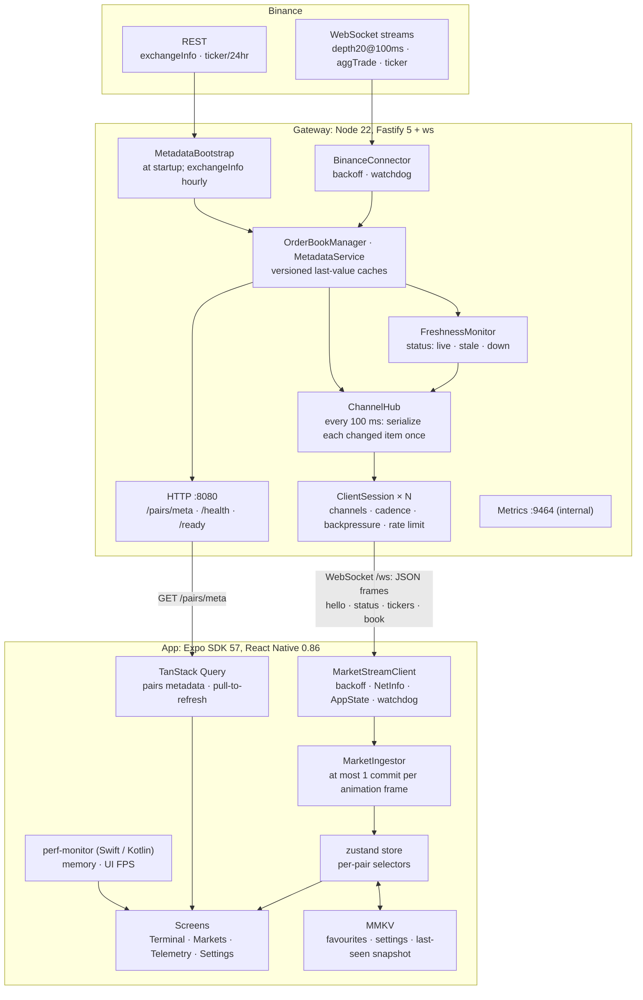

# PulseCrypto

A real-time crypto market viewer in two parts:

- **Gateway** (`backend/`): a Node.js service that ingests Binance public market streams for five USDT pairs, conflates them into the latest state in memory, and fans it out to mobile clients over one WebSocket, at most one data frame per client per 100 ms tick.
- **App** (`mobile/`): a React Native (Expo) app with a live watchlist (search, persisted favourites, pull-to-refresh), a pair terminal (order book, spread, buy/sell pressure, depth chart), a telemetry screen and settings. It keeps working offline with the last data it received and reconnects on its own.

**Demo recordings** (video only, driven by Maestro against the live gateway): [iOS simulator](https://github.com/nimeshkavinda/PulseCrypto/releases/download/v1.0.0/pulsecrypto-ios.mp4) · [Android emulator](https://github.com/nimeshkavinda/PulseCrypto/releases/download/v1.0.0/pulsecrypto-android.mp4), attached to the [v1.0.0 release](https://github.com/nimeshkavinda/PulseCrypto/releases/tag/v1.0.0). They cover the live watchlist, search, a favourite surviving a relaunch, the terminal, a pair switch, pull-to-refresh, the offline banner and automatic reconnect, a cadence change, and the telemetry screen with its overlay.

| Document | What it covers |
|---|---|
| [docs/protocol.md](docs/protocol.md) | The WebSocket protocol: channels, messages, cadence, flow control, limits |
| [docs/performance.md](docs/performance.md) | Load-test and on-device measurements, with method and caveats |
| [docs/design.md](docs/design.md) | Architecture, data flow, decision records with the alternatives rejected, scaling design |
| [docs/requirements.md](docs/requirements.md) | Each brief requirement → where it is implemented → how it is verified |
| [docs/tasks.md](docs/tasks.md) | The task backlog, by phase; task IDs appear in commit messages |
| [docs/specs/](docs/specs/README.md) | Detailed change specs: intent, edge-case matrix and review log |

**Stack.** npm workspaces monorepo:
- `shared`: the protocol and REST schemas (zod), used by both sides.
- `backend`: Fastify 5 + `ws`, Node 20. Docker image on `node:22-alpine`.
- `mobile`: Expo SDK 57, React Native 0.86.3, React 19.2, expo-router, zustand, Reanimated 4, FlashList 2, MMKV 4, NetInfo, plus a local Expo Module, `mobile/modules/perf-monitor` (Swift + Kotlin), for native memory and frame-rate readings.

---

## 1. Quick start

**Prerequisites:**
- Node 20.19.4+ or 22.13+ (React Native 0.86 requires it) and npm 10+
- Docker with Compose
- iOS: Xcode with an iOS simulator, and CocoaPods
- Android: Android Studio with an emulator, JDK 17 and `ANDROID_HOME` set
- Optional: the [Maestro](https://maestro.dev) CLI for the E2E flows
- Free ports 8080 (gateway), 9464 (metrics) and 8081 (Metro)

The native `ios/` and `android/` projects are generated by the first build (`expo prebuild`) and are not committed.

```bash
npm ci                 # install all workspaces
npm run dev:backend    # gateway in Docker on :8080 (long-running; docker compose up --build)
```

In another terminal, check it is up:

```bash
curl -s localhost:8080/health       # liveness
curl -s localhost:8080/ready        # 200 once metadata is loaded and the Binance feed is connected (live or stale)
curl -s localhost:8080/pairs/meta   # display name, status, 24h stats for the five pairs
curl -s 127.0.0.1:9464/metrics      # Prometheus metrics (internal port; /metrics on :8080 is 404)
```

If `/ready` stays 503 and the gateway logs show Binance refusing requests (it answers HTTP 451 in restricted regions), the main hosts are unavailable where you are: uncomment the two `data-*.binance.vision` lines in `docker-compose.yml` and run `npm run dev:backend` again.

Then build and launch the app (long-running: a native build, then Metro; the first run takes several minutes):

```bash
npm run dev:mobile:ios        # expo run:ios: builds and installs a debug build on the iOS simulator
npm run dev:mobile:android    # expo run:android: same on the Android emulator
```

The simulators reach the gateway with no configuration: `ws://localhost:8080/ws` on iOS, `ws://10.0.2.2:8080/ws` on the Android emulator.

### Gateway configuration

Every variable has a safe default (`backend/src/config.ts`); the gateway starts with none set.

| Variable | Default | Effect |
|---|---|---|
| `FLUSH_INTERVAL_MS` | `100` | Server tick: how often frames are built (max `10000`) |
| `WS_SOFT_LIMIT_BYTES` | `65536` | Above this socket buffer, the client's frame for that tick is skipped |
| `WS_HARD_LIMIT_BYTES` | `1048576` | Above this, the client is closed with 1013 |
| `WS_LAG_GRACE_MS` | `5000` | How long a client may stay above the soft limit before it is closed with 1013 |
| `WS_MAX_PAYLOAD_BYTES` | `4096` | Largest inbound message; larger closes with 1009 |
| `WS_MAX_CONNECTIONS` | `10000` | Connections per process; further upgrades get 503 |
| `WS_RATE_LIMIT_BURST` / `WS_RATE_LIMIT_PER_SEC` | `20` / `10` | Inbound message token bucket; empty closes with 1008 |
| `WS_HEARTBEAT_MS` | `30000` | Protocol ping interval; a client that misses a pong is terminated |
| `STALE_AFTER_MS` | `3000` | A pair whose book hasn't updated for this long is reported stale |
| `BINANCE_WS_URL` / `BINANCE_REST_URL` | `wss://stream.binance.com:9443` / `https://api.binance.com` | Upstream hosts. Where the main hosts are restricted, use `wss://data-stream.binance.vision` / `https://data-api.binance.vision` (commented out in `docker-compose.yml`) |
| `METRICS_PORT` | `9464` | Prometheus port. Compose binds it to 127.0.0.1 only |
| `ALLOWED_ORIGINS` | `*` | Browser origins allowed on `/ws` (and for HTTP CORS when `NODE_ENV=production`); see [Mockup deviations](#8-mockup-deviations) |
| `PORT` / `HOST` / `NODE_ENV` | `8080` / `0.0.0.0` / `development` | Listen address; Compose sets `NODE_ENV=production` |

To run the gateway without Docker (hot reload): `npm --prefix backend run dev`.

## 2. Run on devices

Two kinds of native build are used below. A **debug build** loads its JavaScript from Metro and has React Native's development tooling. A **release build** bundles the JavaScript and is what the measurements in [docs/performance.md](docs/performance.md) use. Both include the app's native modules (MMKV and `perf-monitor`).

**Debug build (primary).** `npm run dev:mobile:ios` / `dev:mobile:android` build it, install it and start Metro. Once it is installed, later sessions only need Metro; start it, then open the installed PulseCrypto app:

```bash
npm run dev:mobile   # expo start -c (long-running)
```

**Expo Go (fallback).** Start Metro the same way and press `i` or `a` to open the app in Expo Go (the SDK 57 version; the CLI installs it on simulators). Expo Go can't load the app's own native code, so two things change: storage falls back to a SQLite key-value store instead of MMKV (still persistent), and the Telemetry memory/UI-FPS readings show as unavailable instead of estimating.

**Physical device.** Point the app at your machine's LAN address when building or starting Metro; `EXPO_PUBLIC_*` values are inlined into the bundle:

```bash
EXPO_PUBLIC_GATEWAY_URL=ws://<LAN-IP>:8080/ws npm run dev:mobile:android -- --device   # pick the phone from the list
```

```bash
EXPO_PUBLIC_GATEWAY_URL=ws://<LAN-IP>:8080/ws npm run dev:mobile   # debug build already installed
```

An Android phone needs USB debugging enabled; the CLI forwards Metro's port over USB. An iPhone (`npm run dev:mobile:ios -- --device`) needs a signing team set for the project in Xcode.

The app picks its gateway in this order: the Settings override (debug builds only) → `EXPO_PUBLIC_GATEWAY_URL` → `expo.extra.gatewayUrl` → the platform default above. Android release builds allow cleartext (`ws://`) only to `localhost`, `127.0.0.1` and `10.0.2.2`; debug builds allow it everywhere, so a debug build on a phone can reach a LAN gateway.

**Release builds:** `npm run dev:mobile:ios -- --configuration Release` or `npm run dev:mobile:android -- --variant release` (each builds and installs).

## 3. Testing

```bash
npm run typecheck && npm run lint && npm test
```

315 tests: 29 in `shared` (protocol and REST schemas), 111 in `backend` (hub, backpressure, limits, upstream parsing, freshness, routes, and a Fastify + `ws` integration suite), 175 in `mobile` (stream client state machine, store and render isolation, screens, order book, storage, telemetry).

**Offline behaviour.** With the app open:

```bash
docker compose stop gateway    # app: reconnecting banner with a countdown; the last prices stay on screen
docker compose start gateway   # app: reconnects and returns to LIVE with no user action
```

On Android you can also toggle airplane mode on the emulator; the watchdog notices the dead socket and the app parks offline until the network returns.

**Load test.** The production app and hub against a synthetic market, with many real `ws` clients (2% of them deliberately slow). It imports the built `shared` package, so build it once first:

```bash
npm run build:shared
npm --prefix backend run loadtest -- --clients 500 --duration 10 --workers 2   # the CI smoke run
npm --prefix backend run loadtest -- --clients 5000 --duration 30             # a full run (long-running)
```

**E2E (Maestro).** Three flows in `mobile/.maestro/`: `watchlist` (live rows, search, un-favourite, cold relaunch), `terminal` (price, pressure and spread, scrolling to the depth chart) and `offline` (airplane mode and recovery; Android only). With a gateway running and the app installed:

```bash
maestro test mobile/.maestro/                              # Android emulator or device
maestro test --exclude-tags android-only mobile/.maestro/  # iOS simulator (no airplane-mode control)
```

Build targets and the deterministic synthetic feed are described in [mobile/.maestro/README.md](mobile/.maestro/README.md).

**CI** (`.github/workflows/ci.yml`), on every push to `main` and every PR:
- `checks`: typecheck, lint, tests.
- `docker`: builds the gateway image and checks `/health` on the running container.
- `loadtest-smoke`: 500 clients for 10 s; fails if fewer than 95% of healthy clients stay connected or they drop below 9 frames/s.
- `android-e2e` (manual): builds the release APK, starts the synthetic gateway and runs the Maestro flows on an emulator.

## 4. Architecture



Each screen subscribes only to what it shows: the watchlist to `tickers`, the terminal to `tickers` plus one `book:<PAIR>`. The zod schemas in `shared/src/protocol.ts` define the protocol for both sides. The gateway validates client commands with them; the app checks incoming frames with lightweight hand-written guards (the per-tick path) and uses zod for REST responses and stored snapshots. Details: [docs/design.md](docs/design.md) and [docs/protocol.md](docs/protocol.md).

## 5. Buffering, conflation & backpressure

Market data is last-value data: once a newer order book exists, the older one is worthless. So the gateway conflates rather than queues, and nothing is ever queued per client. The gateway keeps the latest version of each item and sends each client what it hasn't seen yet.

- **Upstream.** Binance `depth20@100ms`, `aggTrade` and `ticker` streams update versioned last-value caches (one order book and one ticker per pair). Bursts between ticks are conflated: each update overwrites the previous one.
- **Per tick.** Every `FLUSH_INTERVAL_MS` (100 ms), `ChannelHub` serializes each changed item once. Each client gets at most one data frame per tick, containing only its subscribed channels (`tickers`, `book:<PAIR>`) whose version it hasn't seen. Clients with identical pending state share one pre-encoded buffer.
- **Cadence.** A client can ask for a slower rate with `setCadence`. It is rounded up to a multiple of the tick and clamped between the tick and 10 s.
- **Backpressure.** If a socket's `bufferedAmount` exceeds 64 KiB, that client's frame for this tick is skipped; the next frame it gets carries the latest state. A client that stays over the soft limit for 5 s, or goes over 1 MiB, is closed with 1013. Server memory per client is bounded by the hard limit, and a slow client never delays anyone else.
- **Inbound.** 4 KiB max message (1009), a token bucket of 20 burst / 10 per second (1008), a connection cap (503 before the upgrade), and a 30 s heartbeat.
- **Freshness.** Every client receives `status`: `connecting`, `live`, `stale` (with `stalePairs`) or `down`, so the app can tell "my socket is fine" apart from "the exchange feed is stale".
- **Mobile.** The stream client is a state machine: full-jitter backoff from 1 s to 30 s with a 250 ms floor, a 10 s connect timeout, attempts reset on the first data message, NetInfo and AppState handling, and an idle watchdog. It feeds an ingestor that commits to the zustand store at most once per animation frame. Per-pair selectors mean updating one pair doesn't re-render another, and hidden tabs stay mounted but stop re-rendering until they are shown again.

Measured in the load test: every slow reader was skipped and then closed, and no healthy client was lost ([docs/performance.md](docs/performance.md)).

## 6. Key decisions

Each is written up in [docs/design.md](docs/design.md) with its context, the alternatives rejected and the consequences.

| Decision | Instead of |
|---|---|
| Opt-in channels with per-client versioned delta frames | Broadcasting every pair's full payload to every client |
| Skip-and-close backpressure over a last-value cache | Per-client queues, or degrading payloads by tier |
| `depth20@100ms` partial snapshots | Diff-depth streams synced against a REST snapshot |
| JSON text frames | A binary encoding, or `permessage-deflate` |
| In-process last-value cache, single gateway process | An external broker (Redis, NATS, Kafka) for the demo |
| Fastify + `ws` | Express, Socket.IO, uWebSockets.js |
| Server-side cadence per client (`setCadence`) | Throttling only in the app, after the bytes have arrived |
| External store, frame-batched commits, per-pair selectors | React context/state updated per message |
| Native builds with MMKV and a native perf module; Expo Go as fallback | Expo Go only, AsyncStorage, JS-estimated telemetry |
| `react-native-svg` depth chart, Reanimated `scaleX` bars | Skia; animating `width` |

## 7. Assumptions

- Five USDT pairs: BTC, ETH, SOL, DOGE, XRP.
- The data is public market data, so there is no authentication. TLS and auth belong at the edge (load balancer) in front of the gateway.
- A single gateway process for the demo; [scaling](#10-scaling) covers more.
- Freshness uses the gateway's receive time on the server and the device's receive time in the app, so clock skew between machines can't mark live data stale.
- The app shows the top 10 levels per side; the gateway publishes 20.
- The drawer's account items (API keys, security, trade history, support) are static screens; there are no accounts.

## 8. Mockup deviations

Where the app differs from the UI mockup supplied with the brief:

| Mockup | Implemented | Why |
|---|---|---|
| Depth chart | Cumulative quantity against price | A true depth chart |
| Cadence slider from 10 ms | Minimum is the gateway tick, 100 ms | The gateway can't emit faster than its tick, and Binance depth updates every 100 ms |
| Market cap | 24h volume | Market cap needs off-exchange supply data |
| "Binary Protocol Compression" | Removed | Frames are JSON text, and React Native's iOS WebSocket can't negotiate `permessage-deflate` |
| "Adaptive Polling" | Adaptive server cadence | The app doesn't poll. When the Settings toggle is on (off by default), on cellular or metered networks it asks the gateway for `max(preference, 500 ms)` |
| Telemetry memory/FPS | Native readings from `perf-monitor` | Measured on the device by native code; a performance overlay (toggled on Telemetry) shows them over the other screens |
| — | `ALLOWED_ORIGINS=*` by default | The data is public and unauthenticated, and native apps send no `Origin` header. Set it when serving browsers or authenticated data |

## 9. Trade-offs

- **`depth20` snapshots rather than diff-depth sync:** simpler and self-healing (no sequence gaps to recover from), but no full book beyond 20 levels.
- **JSON rather than binary:** easy to debug and inspect, but larger on the wire.
- **An in-process last-value cache rather than a broker:** single-node simplicity; scaling out needs a fan-out tier.
- **Skipping frames under backpressure:** freshness wins over completeness. A congested client sees fewer, current frames, never a backlog.
- **Native builds rather than Expo Go as the primary path:** needed for the native modules, at the cost of a native build on first run.
- **Per-screen channel subscriptions:** less bandwidth, but screens re-subscribe when they gain focus.

## 10. Scaling

From the load test ([docs/performance.md](docs/performance.md)), one gateway process (single-threaded Node, so CPU is of one core) on an Apple M4 Pro, with the clients on the same machine over loopback:

| Clients | CPU | Tick p99 | Frame latency p99 |
|---:|---:|---:|---:|
| 1,000 | 16.6% | 19.3 ms | 19 ms |
| 5,000 | 33.4% | 35.9 ms | 33 ms |
| 10,000 | 58.4% | 73.3 ms | 59 ms |

About 14.5 KB/s per client (70/30 watchlist/terminal mix); every slow reader closed and zero healthy clients lost. The largest share of busy time is socket writes (`writev`), not hub logic, so capacity grows with processes and cores rather than tuning.

The practical ceiling is roughly 12–15k clients per process for this mix, and the latency figures are upper bounds because the clients compete with the gateway for CPU.

**1M concurrent clients** at that rate is ~14.5 GB/s (~116 Gbit/s) of egress and, at 12–15k clients each, ~70–90 gateway processes. Egress is the cost, so the levers, in order:
1. **Send less:** slower cadence for watchlist screens, disconnect when backgrounded (the app already does).
2. **Encode smaller:** delta-encoded books and a compact binary encoding.
3. **Fan out closer to users:** one ingestion service connects to Binance and publishes last values to an internal feed; stateless regional gateway replicas subscribe to it and serve clients, scaled on connection count and drained gradually on deploys.

Beyond capacity, production needs a standby ingestion connection (Binance limits connections and request weight per IP, so gateways must not each connect upstream), alerting on the gateway metrics, and TLS at the edge. The full design is in [docs/design.md](docs/design.md#5-scaling-design), observability in [docs/design.md](docs/design.md#6-observability).

## 11. AI-assisted development

**Tools.** Gemini 3.8 (in Antigravity), Muse Spark 1.3 (in OpenCode) and Claude Code (Anthropic), used across the project for implementation and code review.

**Method (BMAD, spec-driven).** The project started from a spec: requirements, design and a phased task backlog in `docs/` (the first commit), with task IDs carried into commit messages. An agent implemented each phase against its tasks, and every phase reached `main` through a pull request. As the work grew, each phase also got a detailed change spec with a frozen intent, an edge-case matrix and a review log ([docs/specs/](docs/specs/README.md)). Independent AI review passes ran in parallel (the diff read without context, edge-case path tracing, and claims that lack a test), and a human triaged every finding. Changes were verified on both simulators, with Maestro and with frame and memory measurements, and a human decided at every checkpoint and PR.

**Defects caught by review or testing**, among others:
- The `perf-monitor` native sources were excluded by broad `ios/` / `android/` ignore rules.
- A loopback-only cleartext config also broke debug builds on physical devices.
- `freezeOnBlur` suspended hidden tabs and could leave the Terminal stuck, so it was replaced by a context-based pause.
- Dev-build memory growth was traced with `heap` to React Native's debug-only Fabric leak checker; release builds stay flat.
- The client's backoff reset could be defeated by the gateway's `hello`, so it now resets on the first data message.
- The favourite star was unreachable by VoiceOver.

**Human role.** Set the scope, made the product and security decisions, reviewed and approved the specs and PRs, and tested on devices.

## 12. Git workflow

- One branch per phase (`phase/<n>-<name>`), plus `fix/<topic>` branches for fixes found in review and testing.
- Every change reaches `main` through a pull request (CI runs on every PR from Phase 14 on). PRs are merged with merge commits, so each phase stays visible in the history.
- Conventional commits; commits that implement backlog tasks name their task IDs from [docs/tasks.md](docs/tasks.md), e.g. `feat(mobile): live watchlist rows, price flashes, freshness indicators and terminal metrics (T12.1–T12.4)`.

## 13. Repository layout

```
shared/          zod schemas: protocol v1 (protocol.ts) and REST (schemas.ts)
backend/
  src/           binance.ts (upstream), orderbook.ts, metadata.ts, market/ (bootstrap, freshness),
                 hub/ (ChannelHub, ClientSession), ws/, http/, config.ts, server.ts
  scripts/loadtest/  load-test runner, client workers, synthetic-market gateway
  tests/         Vitest unit and integration tests
  Dockerfile
mobile/
  src/app/       expo-router routes: drawer + tabs (Terminal, Markets, Telemetry, Settings)
  src/data/      stream client, runtime, ingestor, store, freshness, adaptive cadence
  src/components/  screens and widgets
  src/storage/   MMKV / SQLite repository
  modules/perf-monitor/  native memory and UI FPS (Swift + Kotlin)
  plugins/       config plugins (Android cleartext policy, iOS scene lifecycle)
  .maestro/      E2E flows
  tests/         jest-expo + React Native Testing Library
docs/            protocol, performance, design, requirements, tasks, specs/
.github/workflows/ci.yml
docker-compose.yml
```

## License

MIT, see [LICENSE](LICENSE).
