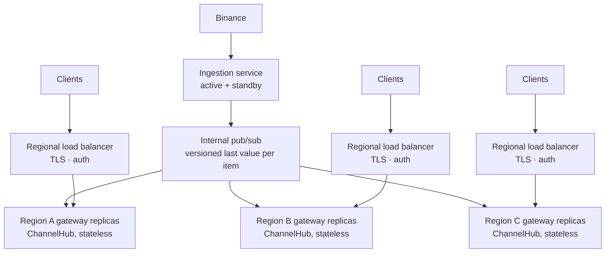

# Design

How PulseCrypto is put together and why. The wire protocol is specified in [protocol.md](protocol.md) and the measurements are in [performance.md](performance.md); this page links to both rather than repeating them.

## 1. Goals

- Show live market data for five pairs on a phone, smoothly, under sustained bursts.
- Keep gateway memory bounded no matter how slow a client is, and never let one client slow down another.
- Send each client only what its current screen shows, and only what changed.
- Keep showing the last known data when the network goes away, say so clearly, and recover without user action.
- Back performance figures with measurements, both in the app's telemetry and in the docs.

## 2. Architecture

The README has the [full diagram](../README.md#4-architecture). Components:

### Gateway (`backend/`)

| Component | Responsibility |
|---|---|
| `BinanceConnector` (`binance.ts`) | One combined WebSocket stream for `depth20@100ms`, `aggTrade` and `ticker` per pair. Capped exponential backoff with full jitter, a handshake timeout, an idle watchdog, and a backoff reset on the first valid stream message. Invalid frames are counted and dropped. |
| `MetadataBootstrap` (`market/bootstrap.ts`) | REST `exchangeInfo` (decimals, trading status; refreshed hourly) and `ticker/24hr` at startup, so `/pairs/meta` has exchange values before the first stream message. |
| `OrderBookManager`, `MetadataService` | Versioned last-value caches: one order book and one ticker per pair. Every accepted update bumps the item's version. A trade never moves the price backwards in exchange time. |
| `FreshnessMonitor` (`market/freshness.ts`) | Derives `status` (`connecting` / `live` / `stale` / `down`, plus `stalePairs`) from the order book stream, using the gateway's receive time. |
| `ChannelHub` + `ClientSession` (`hub/`) | The fan-out. Per client: subscriptions, cadence, the version of each item last sent, the token bucket and the lag timer. Per tick: serialize each changed item once, build at most one frame per client, apply backpressure. |
| Routes (`ws/`, `http/`) | `/ws` (origin check and connection cap before the upgrade), `/pairs/meta` (ETag, 503 + `Retry-After` until bootstrapped), `/health` (liveness), `/ready` (metadata loaded and upstream live or stale). `/metrics` is served by a separate Fastify instance on `METRICS_PORT`. |
| `config.ts` | zod-validated environment with safe defaults; rejects a soft limit that isn't below the hard limit. |

### App (`mobile/`)

| Component | Responsibility |
|---|---|
| `MarketStreamClient` (`data/stream/`) | Framework-free connection state machine: `idle → connecting → open → backoff`, plus `offline` (NetInfo) and `paused` (app backgrounded; socket closed). Full-jitter backoff 1 s → 30 s with a 250 ms floor, 10 s connect timeout, ping/RTT, idle watchdog, resubscribe and cadence restore on reconnect. Checks frames and messages with lightweight hand-written guards (the per-tick path, so no schema library) and drops what fails. |
| `MarketIngestor` (`data/store/ingestor.ts`) | Accumulates messages and commits them to the store at most once per animation frame. |
| Market store (`data/store/marketStore.ts`) | zustand store outside React. Components read through per-pair selectors (`useTicker(pair)`, `useBook(pair)`), so a BTC update doesn't re-render the ETH row. |
| `StreamRuntime` (`data/StreamRuntime.ts`) | Composition root: client → ingestor → store, snapshot persistence, a ref-counted channel registry (screens `acquire` channels while focused), and adaptive cadence from NetInfo. |
| `ScreenActivity` (`data/screenActivity.ts`) | Tabs stay mounted; a hidden tab reads the store paused (no re-renders) and catches up when shown. |
| Persistence (`storage/`, `data/store/persistence.ts`) | MMKV in dev and release builds, a SQLite key-value store in Expo Go. Favourites, settings, and a market snapshot saved every 5 s (and on stop) so a cold start or an offline session shows real, clearly labelled "last seen" data. |
| REST (`api/`, `hooks/usePairsMetadata.ts`) | TanStack Query for `/pairs/meta`: static metadata, decimals, pull-to-refresh. Independent of the socket, so refreshing never interrupts the stream. Retries a warming-up gateway (503) for as long as it lasts. |
| `perf-monitor` (`modules/perf-monitor/`) | Expo Module in Swift and Kotlin: process memory footprint (iOS `phys_footprint`, Android PSS) and UI-thread FPS (`CADisplayLink` / `Choreographer`). On Android it also measures JS-thread FPS with a per-frame probe on the JS queue, because `requestAnimationFrame` under-reports there; iOS counts rAF callbacks. Returns null where it isn't compiled in, and the UI then says "unavailable". |

## 3. Data flow

**One order book update, end to end:**

1. Binance sends a `depth20@100ms` snapshot for ETHUSDT. `BinanceConnector` parses it; `OrderBookManager` replaces the ETH book, computes spread, spread % and buy/sell pressure, and bumps its version. The freshness clock for ETH resets.
2. More updates may arrive before the next tick. Each overwrites the last; nothing accumulates.
3. On the tick, `ChannelHub` sees the ETH book version changed and serializes it once. For each client whose cadence is due: if it subscribes to `book:ETHUSDT` and was last sent an older version, the item goes into that client's frame, together with any other changed subscribed items. Clients with identical pending content share one encoded buffer.
4. Before writing, the hub checks the socket: over the soft limit, the frame is skipped and the lag timer runs; over the hard limit, or lagging past the grace period, the client is closed with 1013. Otherwise the frame is written and the client's sent versions advance.
5. On the phone, `MarketStreamClient` checks the frame and hands the messages to `MarketIngestor`, which commits them on the next animation frame. Only components selecting ETH's book re-render: the order book rows animate their `scaleX` bars on the UI thread, and the depth chart redraws.

**Connection loss:** the app's socket closes or goes silent (watchdog) → `backoff` with a countdown, or `offline` if NetInfo reports no network → the store keeps its values, and the UI shows a banner with how old they are → on reconnect, the client resubscribes its channels and restores its cadence, and the first frame brings every subscribed item up to date. The backoff attempt counter resets when market data actually arrives (not on `hello` or `status`), so a gateway that accepts and then drops connections still backs off; it also resets when the network returns or the app comes to the foreground.

**Upstream loss:** the gateway keeps serving its last values while `status` changes to `stale` (for the affected pairs) or `down`. The app surfaces exchange-side problems even while its own socket is healthy.

## 4. Decision records

### ADR-1: Opt-in channels with per-client versioned delta frames
- **Context:** The watchlist needs five tickers; the terminal needs tickers plus one 20-level book. Broadcasting every pair's full state to every client multiplies bandwidth by the number of books nobody is looking at.
- **Decision:** Clients subscribe to `tickers` and `book:<PAIR>`. The gateway tracks the version of each item last sent to each client, and each tick sends only newer versions of subscribed items, batched into one frame. Each item is serialized once per tick regardless of audience.
- **Alternatives rejected:**
  - *One combined payload per pair, broadcast to all:* simplest, but wastes bandwidth on unwatched books.
  - *Socket.IO rooms:* channel semantics, but a heavier framing protocol, and per-client version tracking would still be needed.
  - *Per-client message queues:* deliver every update, which for last-value data means delivering stale data.
- **Consequences:** About 14.5 KB/s per client in the load test's 70/30 watchlist/terminal mix. Screens re-subscribe when they gain focus. The protocol is versioned (`v: 1`) and documented in [protocol.md](protocol.md).

### ADR-2: Skip-and-close backpressure over a last-value cache
- **Context:** A client on a poor network stops draining its socket. Anything the gateway buffers for it is memory, and anything it waits for delays others.
- **Decision:** Never queue. Above `WS_SOFT_LIMIT_BYTES` (64 KiB buffered), skip that client's frame for the tick; version tracking means the next frame carries the latest state. Close with 1013 (Try Again Later) above `WS_HARD_LIMIT_BYTES` (1 MiB) or after `WS_LAG_GRACE_MS` (5 s) over the soft limit.
- **Alternatives rejected:**
  - *A bounded per-client queue with drop-oldest:* bounded memory, but a recovered client replays data that is already out of date.
  - *Degrading the payload by tier (e.g. dropping order books first):* keeps sending bytes to a socket that can't take them, and the client gets inconsistent partial state.
  - *Close as soon as the buffer grows:* punishes brief network hiccups that a short grace period absorbs.
- **Consequences:** Per-client memory is bounded by the hard limit. In the load test every slow reader was skipped and then closed, and no healthy client was lost. A congested client sees fewer frames, never old ones.

### ADR-3: `depth20@100ms` partial snapshots
- **Context:** The terminal shows the top of the book. A full local book needs Binance's diff-depth stream plus a REST snapshot, synchronized by update IDs, with resync on any gap.
- **Decision:** Subscribe to `<pair>@depth20@100ms`: each message is a complete top-20 snapshot.
- **Alternatives rejected:** *Diff-depth with snapshot sync:* a full book, but gap detection, resync and more state for depth nobody on a phone screen sees.
- **Consequences:** Simple and self-healing: any message fully replaces the book. No depth beyond 20 levels, and book snapshots carry no exchange event time (`eventTs` is `null`), so freshness uses receive time.

### ADR-4: JSON text frames
- **Context:** Frame size drives egress cost, but the protocol also has to be easy to inspect and test.
- **Decision:** UTF-8 JSON text frames, defined by shared zod schemas. The gateway validates client commands with them; the app uses cheap hand-written guards on incoming frames and zod for REST and stored data.
- **Alternatives rejected:**
  - *Binary (protobuf, MessagePack):* smaller, but opaque in tooling and adds a codec on both sides.
  - *`permessage-deflate`:* React Native's iOS WebSocket can't negotiate it, and it costs gateway CPU per client.
- **Consequences:** Debuggable with any WebSocket tool. Binary encoding and delta-encoded books are the listed next steps for scale (section 5).

### ADR-5: In-process last-value cache, one gateway process
- **Context:** The demo runs as one service with one upstream connection.
- **Decision:** Keep the caches in the gateway's memory.
- **Alternatives rejected:** *Redis, NATS or Kafka between ingestion and fan-out:* the right shape at scale (section 5), but for one process it adds a network hop and an extra service with nothing to gain.
- **Consequences:** Single-node simplicity. Scaling out needs a fan-out tier. The hub reads versions through a `MarketSource` interface, not from the Binance connector, so a source backed by an internal feed can replace the in-memory one (the hub tests already use a fake source; the load test drives the in-memory one with a synthetic feed).

### ADR-6: Fastify 5 + `ws`
- **Context:** One HTTP surface (`/pairs/meta`, health, readiness) and one WebSocket endpoint that needs direct access to `bufferedAmount` and to the upgrade request.
- **Decision:** Fastify with `@fastify/websocket` (`ws`).
- **Alternatives rejected:**
  - *Express:* works, but Fastify's schema-based routes and built-in structured logging fit better.
  - *Socket.IO:* its own protocol on top of WebSocket, rooms and acknowledgements that aren't needed, and less direct control of flow.
  - *uWebSockets.js:* a native dependency with its own API. The load test put the largest share of busy time in the kernel's per-socket writes, which more processes address either way.
- **Consequences:** Standard WebSocket clients work, including React Native's built-in one. Origin and connection-cap checks happen before the upgrade.

### ADR-7: Cadence on the server, per client
- **Context:** The brief asks for a configurable emit interval (default 100 ms); the mockup has an in-app throttle slider.
- **Decision:** `FLUSH_INTERVAL_MS` sets the gateway tick. Each client may request a slower cadence (`setCadence`), rounded up to a whole number of ticks and capped at 10 s. The Settings slider sends it and shows the gateway's acknowledged value. On cellular or metered networks, adaptive mode requests at least 500 ms.
- **Alternatives rejected:** *Throttling only in the app:* the bytes still cross the network, so it saves neither data nor battery.
- **Consequences:** The slider's minimum is the tick (100 ms), not the mockup's 10 ms. A slower cadence never makes data staler than one period, because each frame carries the latest versions.

### ADR-8: External store with frame-batched commits and per-pair selectors
- **Context:** At 10 frames/s with several messages each, updating React state per message re-renders every consumer on every message.
- **Decision:** The stream client and store live outside React. The ingestor commits at most once per animation frame; components subscribe through per-pair selectors. Hidden tabs stay mounted but read the store paused, through a `ScreenActivity` context.
- **Alternatives rejected:**
  - *React context holding the market state:* every consumer re-renders on every update.
  - *`freezeOnBlur` for hidden tabs:* it suspended the hidden screens, and could leave the Terminal stuck when returning to it.
  - *Unmounting hidden tabs:* loses scroll position and pays a remount on every switch.
- **Consequences:** A render-isolation test proves an update to one pair doesn't re-render another. On the Android release build at twice the production rate (20 frames/s, from the load-test gateway with `FLUSH_INTERVAL_MS=50`), terminal frame times were 17/18/19 ms p50/p90/p99 ([performance.md](performance.md)).

### ADR-9: Native builds as the primary path, Expo Go as a fallback
- **Context:** MMKV (synchronous storage) and the `perf-monitor` module are native code, which Expo Go can't load.
- **Decision:** Build debug and release builds with `expo run:ios` / `expo run:android`; the native projects are generated by `expo prebuild` from `app.json` and config plugins, not committed. Keep the app runnable in Expo Go by falling back to `expo-sqlite/kv-store` for storage and showing native telemetry as unavailable.
- **Alternatives rejected:**
  - *Expo Go only:* no MMKV and no native telemetry.
  - *AsyncStorage:* asynchronous reads mean a blank first render at cold start.
  - *JS-estimated memory and FPS:* the JS thread can't see UI-thread frames or process memory, so the numbers would be guesses.
- **Consequences:** A native build on first run. Performance is measured on release builds only; debug builds carry React Native's development tooling, including a Fabric leak checker that grows memory in debug builds only ([performance.md](performance.md#memory)).

### ADR-10: `react-native-svg` depth chart and Reanimated `scaleX` bars
- **Context:** The terminal redraws a depth chart and 20 order book bars on every book update.
- **Decision:** Draw the depth chart (cumulative quantity against price) with `react-native-svg` from pure geometry code (`utils/depthChart.ts`). Animate order book bars with `transform: scaleX` on the UI thread through Reanimated.
- **Alternatives rejected:**
  - *Skia:* more drawing power than a two-area chart needs, for a large native dependency.
  - *Animating `width`:* forces a layout pass per frame; `scaleX` is a transform.
- **Consequences:** The chart geometry is unit-tested without rendering.

### ADR-11: Metrics on an internal port; separate liveness and readiness
- **Context:** Prometheus metrics shouldn't be public, and "the process is up" differs from "the process has data to serve".
- **Decision:** `/metrics` on `METRICS_PORT` (9464; Compose binds it to 127.0.0.1). `/health` answers whenever the process serves HTTP; `/ready` requires loaded metadata and a `live` or `stale` upstream.
- **Alternatives rejected:** *`/metrics` on the public port behind auth:* more configuration for the same result. *A single health endpoint:* a load balancer couldn't tell "restart me" from "don't route to me yet".
- **Consequences:** `/metrics` on 8080 returns 404. Orchestrators can restart on `/health` and route on `/ready`.

## 5. Scaling design

**Measured capacity** ([performance.md](performance.md)): one process holds 10,000 clients at 10 Hz with a tick p99 of 73 ms (inside the 100 ms budget), at about 14.5 KB/s per client. The practical ceiling is roughly 12–15k clients per core for this mix. The largest share of busy time is socket writes; hub logic is a small fraction.

**1M concurrent clients** therefore means ~14.5 GB/s (~116 Gbit/s) of egress and ~70–90 gateway processes. Egress is the dominant cost.

**Shape at scale:**

- **Ingestion:** one active connection to Binance per upstream stream set, with a standby. It publishes each item's latest version; it doesn't fan out to clients.
- **Internal feed:** a pub/sub bus carrying last values. A gateway that joins or reconnects needs only the current value of each item, not a history, so a durable log isn't required.
- **Gateways:** the existing hub, reading from the internal feed through the `MarketSource` interface. Stateless, so they scale horizontally on connection count and CPU. On deploys, drain gradually: stop accepting upgrades (503 + `Retry-After`), then close existing clients spread over a window; the app's full-jitter backoff spreads the reconnects.

**Levers, in order of effect:**
1. **Send less:** slower cadence for watchlist screens (`setCadence 500` → 2 frames/s instead of 10), and disconnect backgrounded apps (the app already closes its socket in the background).
2. **Encode smaller:** delta-encode order books (changed levels only) and use a compact binary encoding. `permessage-deflate` would help only clients that can negotiate it (not React Native on iOS, see ADR-4), and fits the ticker channel better than the book channel, where it costs CPU per client.
3. **Fan out closer to users:** regional replicas cut long-haul egress and latency.

## 6. Observability

- **Gateway metrics** (`:9464/metrics`): connected and lagging clients, frames sent and dropped, bytes sent, tick duration, slow-consumer, rate-limit and heartbeat disconnects, upgrade rejections, upstream messages received and invalid, upstream connection status. All prefixed `pulsecrypto_`.
- **Logs:** structured JSON from Fastify's logger.
- **App:** the Telemetry screen shows UI and JS frame rates, memory, message rate and throughput, and RTT; a performance overlay (toggled on Telemetry) shows frame rates and memory over the other screens.
